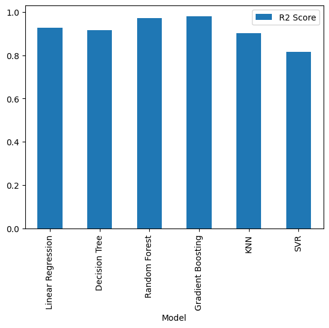

# Data Generation using Modelling and Simulation for Machine Learning  
## UCS654 Assignment 6  
### Name – Saniya Jindal  
### Roll No – 102303183  

---

## 1. Introduction
In many real-world scenarios, collecting large amounts of real data is costly, time-consuming, or impractical.  
Modelling and simulation provide an effective way to generate synthetic data that can be used for machine learning tasks.

In this project, an open-source simulation tool is used to generate data through modelling and simulation, and multiple machine learning models are trained and evaluated on the generated dataset.

---

## 2. Simulation Tool Used
**SimPy** – an open-source, Python-based discrete-event simulation library.

SimPy allows modelling of real-world systems such as queues, networks, and resource-sharing environments. It is lightweight, easy to use, and suitable for integration with machine learning workflows.

---

## 3. Problem Description
A **bank customer queue system** is simulated where:
- Customers arrive at a bank  
- A limited number of service counters are available  
- Each customer experiences a waiting time before being served  

The goal of the simulation is to study how different system parameters affect the **average customer waiting time**, and then use machine learning models to predict the waiting time based on these parameters.

---

## 4. Simulation Model and Parameters

### 4.1 Simulation Model
The system is modelled as a discrete-event simulation using SimPy:
- Customer arrivals follow an exponential distribution  
- Service time also follows an exponential distribution  
- Counters are modelled as limited resources  

### 4.2 Simulation Parameters and Bounds

| Parameter        | Description                              | Lower Bound | Upper Bound |
|------------------|------------------------------------------|-------------|-------------|
| arrival_rate     | Customer arrival rate (per unit time)    | 1           | 10          |
| service_time     | Time taken to serve a customer           | 2           | 15          |
| num_counters     | Number of service counters available     | 1           | 5           |
| simulation_time  | Total simulation duration                | 200         | 500         |

---

## 5. Data Generation Methodology

1. Random values for arrival rate, service time, and number of counters are generated within the defined bounds.  
2. The parameters are passed to the SimPy simulation.  
3. The simulation runs for a fixed duration.  
4. The average waiting time of customers is recorded.  
5. Steps 1–4 are repeated **1000 times** to generate a synthetic dataset.  

Each simulation run produces one data sample.

---

## 6. Dataset Description

| Feature Name   | Description                               |
|---------------|-------------------------------------------|
| arrival_rate  | Customer arrival rate                     |
| service_time  | Service time per customer                 |
| num_counters  | Number of counters                        |
| avg_wait      | Average customer waiting time (target)    |

---

## 7. Machine Learning Models Used
1. Linear Regression  
2. Decision Tree Regressor  
3. Random Forest Regressor  
4. Gradient Boosting Regressor  
5. Support Vector Regressor (SVR)  
6. K-Nearest Neighbors Regressor (KNN)

---

## 8. Model Evaluation Metrics
- Mean Squared Error (MSE)  
- R² Score  

---

## 9. Results and Comparison
A comparison graph of ML models based on **R² Score** is shown below:

Tree-based ensemble models such as **Random Forest** and **Gradient Boosting** performed the best, achieving higher R² scores and lower prediction errors.

---

## 10. Conclusion
This project demonstrates how modelling and simulation can be effectively used to generate synthetic data for machine learning tasks.  
The generated data was successfully used to train and compare multiple ML models.

---

## 11. Files in the Repository
- `simulation_ml.ipynb` – Simulation and ML code  
- `simulation_data.csv` – Generated dataset  
- `README.md` – Project documentation  

---

